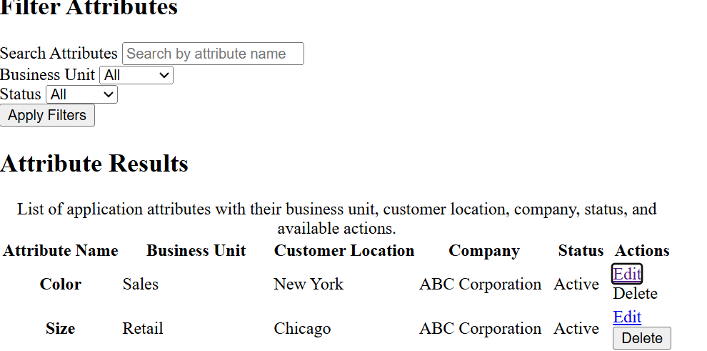
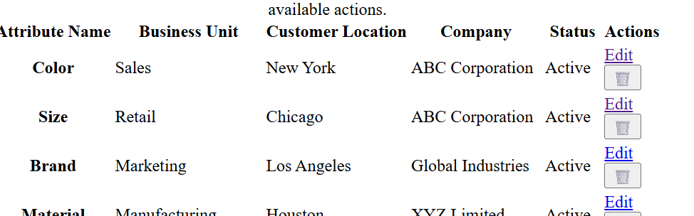

## Bug A – div used as button


**Problem:** A `<div role="button">` was used instead of a real `<button>`.

**Observation:** The element was not reachable using the Tab key and did not activate with Enter or Space.

**Fix:** Replaced the `<div>` with a semantic `<button>` element, which provides keyboard accessibility by default.
Observe
❌ Press Tab → The div does not receive focus (unless tabindex="0" is added).
❌ Press Enter → Nothing happens.
❌ Press Space → Nothing happens.




## Bug B – Icon-only button



**Problem:** The Delete button only displayed a trash icon (`🗑️`) with no accessible text.

**Observation:** The screen reader did not announce a meaningful action, making it unclear that the button deletes an attribute.

**Fix:** Added a visually hidden `<span class="sr-only">Delete</span>` inside the button so screen readers announce "Delete" while only the icon remains visible.

### `.sr-only` Utility Class

The `.sr-only` class hides text visually while keeping it available to screen readers. It is useful for icon-only buttons that still need an accessible name.

```css
.sr-only {
    position: absolute;
    width: 1px;
    height: 1px;
    padding: 0;
    margin: -1px;
    overflow: hidden;
    clip: rect(0, 0, 0, 0);
    white-space: nowrap;
    border: 0;
}
```


## Bug C – Two H1 Headings

**Problem:** A second `<h1>` heading was added to the page.

**Observation:** Lighthouse did not report an accessibility error, but having multiple primary headings can make the page structure less clear. Using a single `<h1>` with `<h2>` headings for sections provides a better document hierarchy.

**Fix:** Changed the second `<h1>` to `<h2>` to maintain a clear heading structure.


## Bug D – Label Not Associated with Input

**Problem:** The **Business Unit** label was not associated with its `<select>` because the `for` attribute was removed.

**Observation:** Before removing `for`, clicking the **Business Unit** label moved focus to the dropdown. After removing it, clicking the label no longer focused the dropdown, making it less accessible and harder to use.

**Fix:** Restored the `for="business-unit"` attribute on the label so it matched the `id="business-unit"` of the `<select>`. Clicking the label once again moved focus to the dropdown.


# CSS Assignment

# Bug A – Absolute Position Without a Positioned Ancestor

## Reproduction

An element with `position: absolute` was placed inside a container that used the default `position: static`.

```css
.toast {
    position: absolute;
    top: 0;
    right: 0;
}
```

## Observation

Instead of appearing in the top-right corner of its parent container, the toast was positioned relative to the page because no positioned ancestor existed.

## Fix

Added:

```css
.toast-container {
    position: relative;
}
```

This establishes the container as the containing block for the absolutely positioned child.

Alternatively, `position: fixed` can be used when the element should remain attached to the viewport.

# Bug C – Margin Collapsing

## Reproduction

A child element with `margin-top` was placed inside a parent without padding, border, or a new formatting context.

```css
.parent { }

.child {
    margin-top: 40px;
}
```

## Observation

The child's top margin collapsed with the parent's margin, causing the space to appear outside the parent instead of inside it.

## Fixes

### Method 1

```css
.parent {
    padding-top: 1px;
}
```

### Method 2

```css
.parent {
    border-top: 1px solid transparent;
}
```

### Method 3 (Recommended)

```css
.parent {
    display: flow-root;
}
```

## Why is `flow-root` the cleanest?

`display: flow-root` creates a new block formatting context, preventing margin collapsing without adding unnecessary padding or borders that could affect the layout or spacing.

# Bug D – Flex Child Overflow

## Reproduction

A flex child containing long or wide content overflowed its container because flex items default to `min-width: auto`.

## Observation

The flex item refused to shrink, causing the layout to overflow.

## Fix

In this project, the issue was prevented by applying:

```css
main,
#main-content {
    min-width: 0;
}
```

This allows the flex item to shrink within the available space, preventing overflow from wide tables or long content.

## Why?

Flex items default to `min-width: auto`, which protects their content from shrinking. Setting `min-width: 0` allows the flex item to shrink when needed, protecting the overall layout instead.