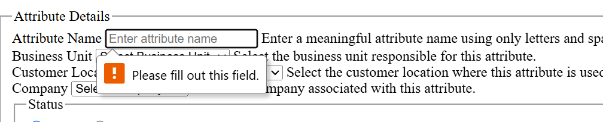
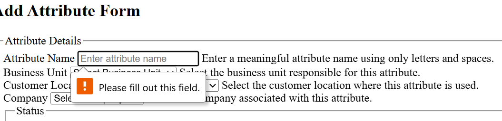
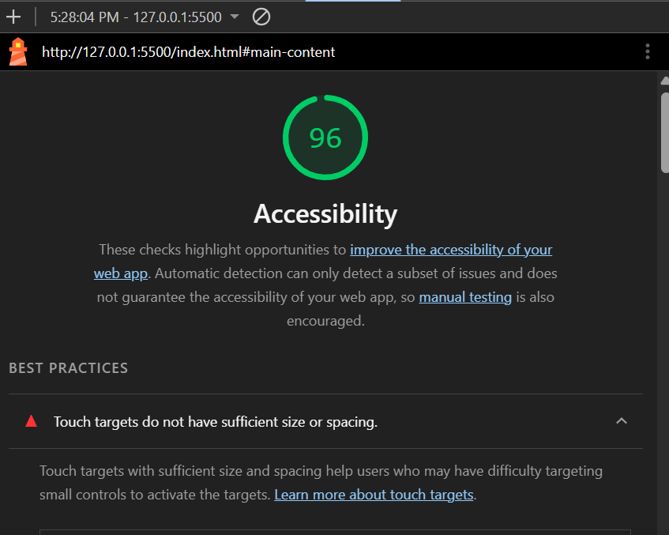
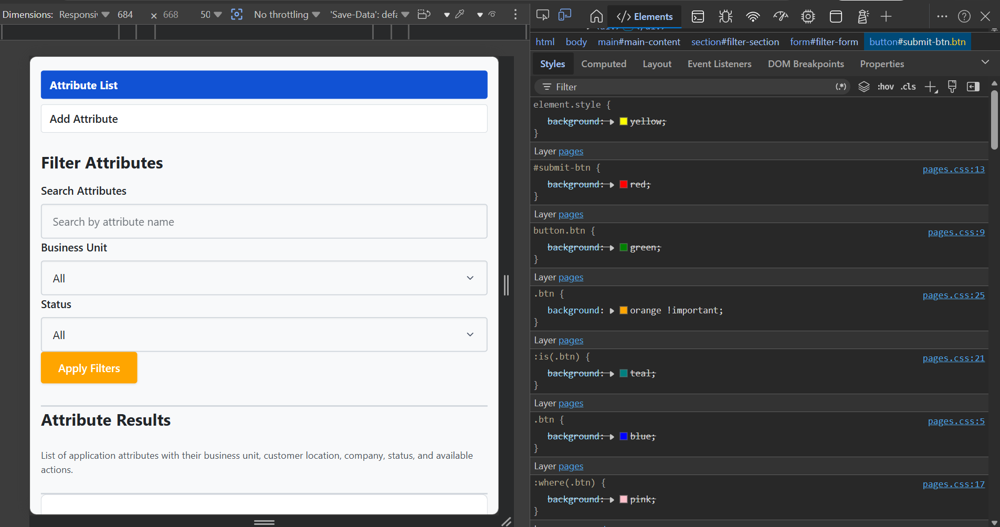
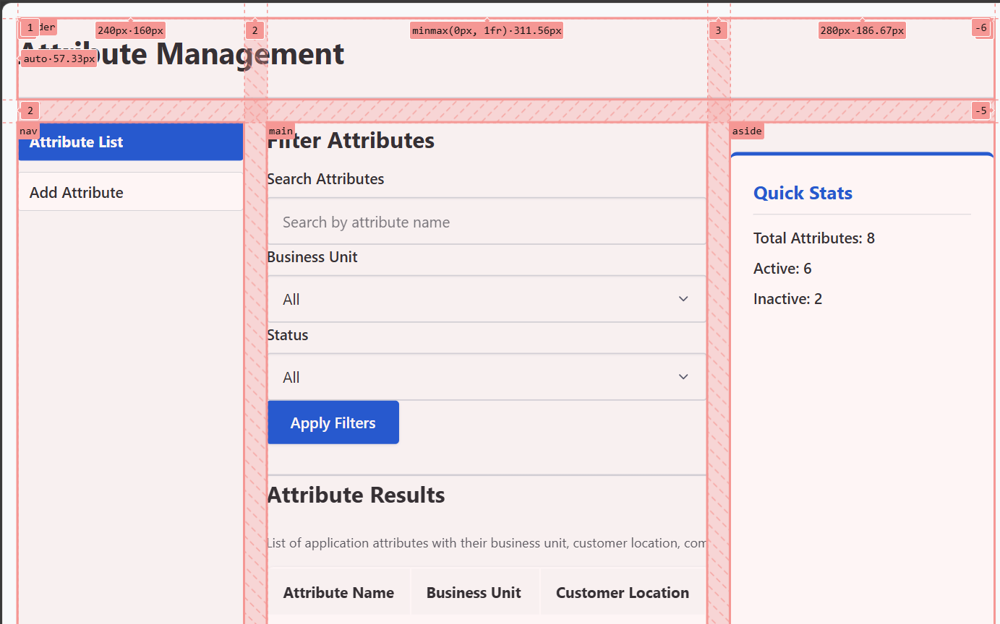
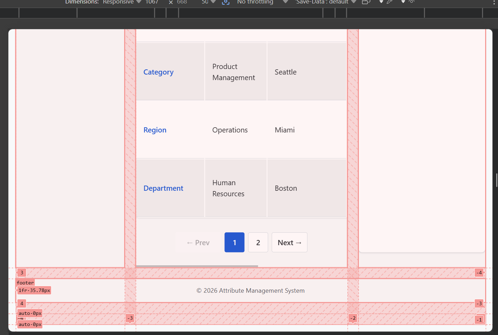
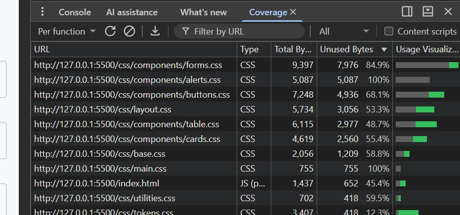
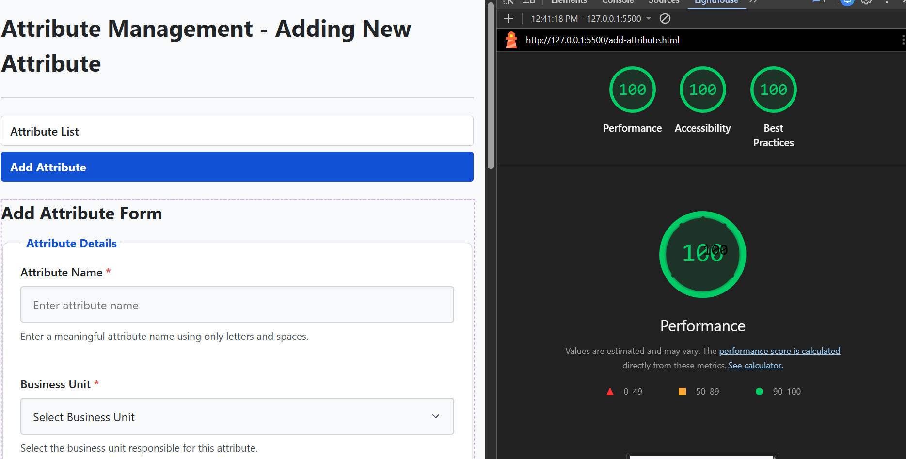
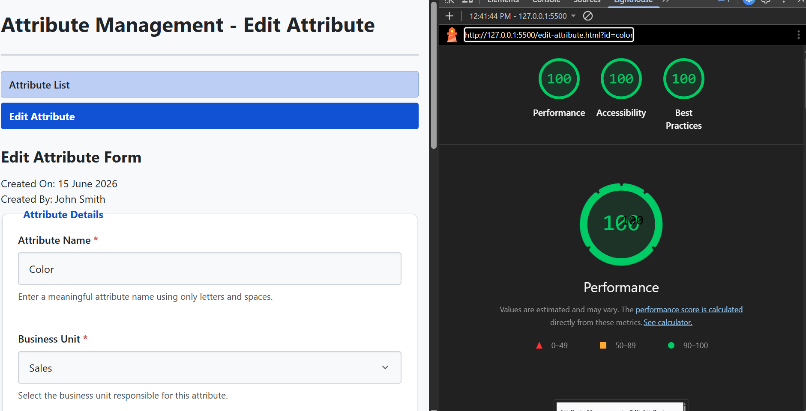
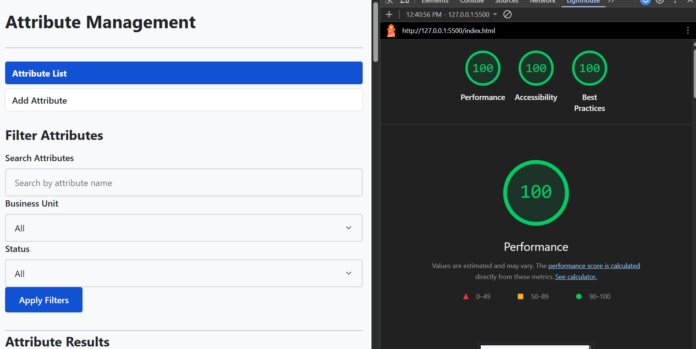

# Attribute App

# Task 1 – Project Structure & HTML Metadata

## Folder Structure

The project is organized into separate folders to keep related files together and make future development easier.

```
attribute-app/
│
├── index.html
├── add-attribute.html
├── edit-attribute.html
│
├── css/
├── js/
├── assets/
├── data/
│
├── README.md
└── BUGS.md
```

## HTML Notes

### Why does the order of `<meta charset>` matter?

The `<meta charset>` tag should be placed near the beginning of the `<head>` section because browsers need to know the character encoding before reading the HTML. It should appear within the first 1024 bytes of the document so the browser can correctly decode the page.

### What does `<meta name="theme-color">` control on mobile?

The `theme-color` meta tag controls the browser UI color on supported mobile devices, such as the address bar and surrounding browser chrome.

---

# Task 2 – HTML5 Landmarks

## Implementation

The pages were structured using HTML5 semantic landmarks:

- `header` with `role="banner"`
- `nav` with `role="navigation"` and `aria-label="Primary"`
- Skip link as the first interactive element
- `main` with `id="main-content"`
- Named `section` elements using `aria-labelledby`
- `aside` for Quick Stats
- `footer` with `role="contentinfo"`

## Reasoning

Semantic landmarks help screen readers understand the page structure and allow users to navigate quickly between important regions.

### When does a `<section>` become a landmark?

A `<section>` becomes a landmark only when it has an accessible name, usually through `aria-labelledby` or `aria-label`.

### Why use a skip link?

The skip link lets keyboard and screen reader users jump directly to the main content without tabbing through the navigation on every page.

# Task 3 – Filter Region

## Implementation

The filter area was built using:

- `<form role="search" method="get">`
- Search input (`type="search"`)
- Business Unit dropdown
- Status dropdown
- Submit button
- Proper `<label for="">` for every control
- `inputmode="search"`
- `autocomplete="off"`
- Live region using `aria-live="polite"` for future result updates

## Reasoning

Using `role="search"` identifies the form as a search region for assistive technologies. Proper labels improve accessibility, while the live region will allow JavaScript to announce filter results without interrupting the user.

# Task 4 – Results Table

## Implementation

The results were displayed using a semantic HTML table containing:

- Table caption
- Column headers with `scope="col"`
- `aria-sort="none"` on sortable columns
- Eight sample rows
- Row headers using `scope="row"`
- Status displayed as text ("Active" / "Inactive")
- Edit action as a link
- Delete action as a POST form with a submit button

## Reasoning

Using semantic table elements makes tabular data easier for screen readers to understand. Text-based status ensures accessibility, and using a POST form for Delete follows proper web semantics.

### Why is Delete a POST form instead of a link?

Deleting data changes application state, so it should use POST rather than GET. GET requests are intended only for retrieving data and can be triggered accidentally by bookmarks, crawlers, or browser prefetching.

# Task 5 – Add/Edit Attribute Form

## Implementation

The Add and Edit pages use a semantic HTML form with:

- `<form method="post" action="#" novalidate aria-labelledby="form-title">`
- `<fieldset>` and `<legend>` to group related fields
- Required fields:
  - Attribute Name
  - Business Unit
  - Customer Location
  - Company
  - Status (radio group)
  - Created On
  - Notes
- Appropriate input types (`text`, `select`, `radio`, `date`, `textarea`)
- Validation attributes (`required`, `minlength`, `maxlength`, `pattern`)
- Proper `<label for="">` for every field
- Hint text connected using `aria-describedby`
- Empty error placeholders with `role="alert"` and `aria-live="polite"`
- Error summary region at the top of `<main>` for future JavaScript validation

## Reasoning

The form is structured to be accessible and ready for future CSS and JavaScript. All fields have unique IDs, labels, hints, and error placeholders so custom validation can be added without changing the HTML.

### Why use `novalidate`?

`novalidate` disables the browser's default validation popups while keeping all HTML validation rules. This allows JavaScript in A3 to display consistent custom error messages using the existing validation attributes.


## Task 6 – Validation Testing

### Test 1: Form Submission with `novalidate`

**Browsers tested:**
- Google Chrome
- Microsoft Edge

**Observation:**

When the form had `novalidate`, the browser allowed submission with required fields empty.

**Result:**
- No native browser validation messages were displayed.
- HTML validation was disabled by the browser.

### Test 2: Form Submission without `novalidate`

After removing `novalidate`, the form was submitted again with empty required fields.

**Result:**
- Microsoft Edge displayed native validation messages.


- Google Chrome showed similar validation prompts.

  

After testing, the `novalidate` attribute was restored.

---

## Three Layers of Validation

### 1. HTML Validation

Built-in browser validation using attributes such as:
- `required`
- `minlength`
- `maxlength`
- `pattern`
- `type`

This provides quick client-side feedback.

### 2. JavaScript Validation

JavaScript enhances validation by:
- displaying custom error messages
- highlighting invalid fields
- showing an error summary
- enforcing additional rules

### 3. Server-side Validation

Server-side validation is mandatory because the client can be bypassed.

Users can bypass browser validation by:
- using developer tools
- removing HTML validation attributes
- disabling JavaScript
- sending requests with `curl` or Postman

Only server-side validation can be trusted in production.

---

## Layout Decisions

### Attribute List (`index.html`)

- **Layout:** Header → filter section → results table → quick stats → footer
- **Rejected:** sidebar filters and extra table columns like Created On / Notes
- **Above the fold:** navigation, filters, and the start of the results table
- **Mobile-first:** stack filters vertically, move Quick Stats below the table, and use a responsive table layout

### Add Attribute (`add-attribute.html`)

- **Layout:** single-column form with grouped fields and bottom action buttons
- **Rejected:** two-column form and top action buttons
- **Above the fold:** page title, error summary, and first required fields
- **Mobile-first:** full-width inputs and buttons with comfortable spacing

### Edit Attribute (`edit-attribute.html`)

- **Layout:** consistent structure with Add page, plus metadata before the form
- **Rejected:** metadata at the bottom and a side panel
- **Above the fold:** page title, record details, and the start of the form
- **Mobile-first:** keep the single-column layout and stack metadata above the form

---

## Keyboard Navigation

### `index.html`

1. Skip to main content
2. Attribute List
3. Add Attribute
4. Search
5. Business Unit
6. Status
7. Apply Filters
8. Edit (row 1)
9. Delete (row 1)
10. Edit (row 2)
11. Delete (row 2)
...
12. Delete (last row)

### `add-attribute.html`

1. Skip to main content
2. Attribute List
3. Add Attribute
4. Attribute Name
5. Business Unit
6. Customer Location
7. Company
8. Status (Active selected; use arrow keys to switch)
9. Created On
10. Notes
11. Save Attribute
12. Reset

### `edit-attribute.html`

1. Skip to main content
2. Attribute List
3. Add Attribute
4. Attribute Name
5. Business Unit
6. Customer Location
7. Company
8. Status (Active selected; use arrow keys to switch)
9. Created On
10. Notes
11. Update Attribute
12. Reset

### Lighthouse Observation

Lighthouse reported the warning **"Touch targets do not have sufficient size or spacing"**, which resulted in an Accessibility score of **96/100**.

**Cause:** The navigation links were displayed close together, so their clickable (touch) areas did not meet the recommended minimum size and spacing for touch devices. Lighthouse evaluates the rendered page, not just the HTML, so even though the navigation used the correct semantic structure (`<nav><ul><li><a>`), the default browser styling left the links too close together.

**Observation:** I tested replacing the semantic list (`<ul><li>`) with direct `<a>` elements inside the `<nav>`, and Lighthouse then reported an Accessibility score of **100/100**. However, this changed the page layout rather than addressing the actual issue.

**Decision:** I kept the semantic list structure because navigation menus should be marked up as a list of links. The warning is related to presentation rather than HTML semantics and will be resolved in the CSS phase by increasing the padding and spacing between the navigation links.





# Day 2 CSS

## Assignment 2 — Task Documentation

### Task 1: CSS Architecture & @layer Strategy
- **File Architecture:** Structured stylesheets into a modular directory (`css/tokens.css`, `css/reset.css`, `css/base.css`, `css/layout.css`, `css/utilities.css`, `css/pages.css`, and `css/components/*.css`) imported into `css/main.css`.
- **Cascade Layers:** Declared layer priority `@layer reset, tokens, base, layout, components, utilities, pages;`.

#### What problem does `@layer` solve over plain link order?
Cascade layers decouple priority from selector specificity (`a,b,c`) and file loading order. Without `@layer`, if a base reset or utility stylesheet accidentally has a higher specificity selector (such as an ID or chained classes), overriding it in a later component file requires artificially increasing specificity or resorting to `!important`. With `@layer`, any CSS rule defined in a higher-priority layer (`components`) automatically wins over rules in lower-priority layers (`reset` or `base`), even if the lower layer has higher selector specificity.

#### Why are `@layers` harder for someone NOT using them to override later?
In the CSS cascade specification, **unlayered CSS (`styles not inside any @layer block`) automatically has higher priority than ALL styles defined inside any `@layer`**. If a developer builds their application entirely inside `@layer` blocks and later a third-party script or developer injects normal unlayered CSS, those unlayered rules immediately override all layered rules regardless of specificity. Conversely, if an external developer tries to override existing unlayered CSS by placing their custom code inside a `@layer`, their overrides will fail because any unlayered rule always defeats layered rules.

#### When is plain link order still preferable?
Plain link order is preferable in simpler projects without complex overrides, or when integrating with legacy codebases and third-party libraries (like Bootstrap or old UI widgets) that rely heavily on selector specificity and unlayered cascades. Wrapping legacy frameworks inside `@layer` can unexpectedly invert specificity hierarchy and break their built-in overrides.

---

### Task 2: Design System & Dark Mode Architecture
- **Tokens Implemented:** Defined centralized CSS custom properties on `:root` for color primitives (`--color-bg`, `--color-primary`), semantic feedback (`--color-danger`, `--color-success`, `--color-focus-ring`), fluid spacing (`--space-1` to `--space-6` in `rem`), fluid typography (`clamp()` on `--fs-xl` and `--fs-2xl`), border radii (`--radius-sm`, `--radius-md`, `--radius-pill`), shadows (`--shadow-1`, `--shadow-2`), and stacking (`--z-toast`, `--z-skip-link`).
- **Dark Mode Strategy:** Implemented dark mode theme overrides using `[data-theme="dark"]`. By changing semantic color variables under this attribute selector, the application switches themes dynamically without modifying component stylesheets.

#### Why are CSS variables superior to Sass variables for runtime theming and `prefers-color-scheme`?
CSS custom properties (`--color-bg`) exist live in the browser's DOM tree at runtime. When the theme attribute (`[data-theme="dark"]`) or system preference (`prefers-color-scheme: dark`) changes, the browser instantly re-evaluates and repaints elements using those variables. Sass variables (`$color-bg`) are preprocessed and compiled away into static hex or rgb strings (`#ffffff`) at build time. To switch themes using Sass variables, a developer would have to duplicate every single component selector (`.dark-theme .card { background: #121212; }`), doubling or tripling CSS payload size and requiring full class toggling across all components.

#### When would Sass variables still beat CSS variables?
Sass variables are superior when performing compile-time calculations, loops (`@for`), map data structures, or static mathematical and color manipulation functions (`darken($base, 10%)`, `lighten()`, `color.adjust()`). If values are static constants across all themes and devices, Sass variables avoid adding hundreds of custom property lookups to the browser's runtime CSS Object Model (CSSOM).

---

### Task 3: Modern Reset & BEM Naming Convention
- **Modern Reset (`reset.css`):** Applied global `box-sizing: border-box` across all elements, normalized heading and paragraph margins (`margin: 0`), made responsive images default (`max-width: 100%; display: block;`), and standardized form control typography (`font: inherit`).

#### BEM Naming Convention & Specificity Flatness
To maintain long-term maintainability without `!important`, all components follow the **BEM (`Block__Element--Modifier`)** naming convention (e.g., `.attribute-card`, `.attribute-card__title`, `.attribute-card--inactive`). BEM enforces **flat specificity**, where every component style has an identical specificity score of exactly one class `(0,1,0)`. Without a strict convention like BEM, developers often chain selectors (`.card .content h3.active`), causing specificity inflation (`(0,2,1)`). When another developer needs to override that style later, they must chain even more selectors or use `!important`, setting off a cascading specificity war where stylesheets grow unmaintainable and unpredictable.

---

### Task 4: Base & Typography (`base.css`)
- **Implemented Rules:** Added logical properties (`margin-inline`, `padding-block`, `margin-block-end`) for internationalization (i18n / RTL readiness), `:target { scroll-margin-top: var(--space-5); }` for anchor link jumps above sticky headers, `.sr-only` accessibility utility, and `::selection` background styling.

#### Why is `outline: none` without a replacement a WCAG failure?
Removing the default focus outline (`outline: none`) without providing a visible focus indicator violates **WCAG 2.1 Criterion 2.4.7 (Focus Visible)**. Keyboard-only users and screen-reader users relying on keyboard tabbing (`Tab` / `Shift+Tab`) cannot see which interactive element currently has focus on the webpage. Without a visible ring, navigation becomes completely blind and unusable.

#### What does `:focus-visible` give you that `:focus` does not?
The traditional `:focus` pseudo-class triggers *whenever* an element receives focus, including when a mouse user clicks a button (`<button>`). Many designers historically removed `:focus` outlines because mouse users complained about unsightly blue rings after clicking buttons. **`:focus-visible` discriminates between input modalities:** the browser uses heuristics to show the focus ring *only* when the user is navigating via keyboard (`Tab` keys) or assistive devices, while hiding it when a mouse or touch user clicks an element. This satisfies both visual aesthetics and WCAG accessibility compliance.

---

### Task 5: Mobile-First Page Layout Grid (`layout.css`)
- **Implemented Rules:** Built responsive page chrome using CSS Grid (`grid-template-areas`) with mobile-first `em`-based breakpoints (`48em` for tablet $\ge 768px$ and `64em` for desktop $\ge 1024px$).

#### Why Mobile-First? What bug does Desktop-First introduce?
Mobile-first styling sets single-column flow as the natural default (`body { display: grid; grid-template-columns: minmax(0, 1fr); }`) without requiring a media query. This avoids the classic "desktop-first bug" where multi-column grid templates, explicit column widths, and large desktop margins must be aggressively overridden or reset (`width: 100%`, `grid-template-columns: 1fr`) on small screens. When overriding complex desktop layouts for mobile, developers frequently encounter specificity wars and overflow bugs that cause horizontal scrollbars on mobile phones. Mobile-first ensures small screens only process baseline styling while larger screens opt into multi-column complexity via `min-width` media queries.

#### Why use `em`-based media queries instead of `px`?
Media queries defined in `em` units (`min-width: 48em`) respect the user's browser font-size scaling preferences. If a user with low vision increases their browser's default font size from `16px` to `24px`, a pixel breakpoint (`min-width: 768px`) remains static at `768px`, causing large text to cram into narrow layout columns or overflow boundaries. An `em` breakpoint (`48em` = `48 * 16px = 768px`) dynamically scales up with the user's base font size (`48 * 24px = 1152px`), ensuring the layout only shifts to a multi-column grid when there is genuine physical screen space to accommodate `48` characters of their zoomed-in text.

#### Why use `grid-template-areas` over named grid lines?
For page-level structural layouts ("page chrome"), `grid-template-areas` provides a self-documenting ASCII visual map of the exact document layout directly in CSS (`"header header header" / "nav main aside" / "footer footer footer"`). Using chains of numeric grid line coordinates (`grid-column: 1 / 4; grid-row: 2 / 3;`) makes layout relationships opaque and prone to breaking during refactoring. With `grid-template-areas`, moving a sidebar from the right column to the left requires editing only a single string matrix without modifying the individual component styles.

---

### Task 6: Container Queries (`@container`) for Attribute Cards
- **Implemented Rules:** Added `container-type: inline-size; container-name: attribute-list;` to the table/card wrapper (`tbody` / `#results-section`). Inside `@container attribute-list (max-width: 320px)`, the card collapses down to a compact 1-line summary displaying only the Attribute Name header and Status/Action badges (`td:not(:last-child):not(:nth-last-child(2)) { display: none; }`).

#### When does a Container Query (`@container`) beat a Media Query (`@media`)?
A Media Query (`@media (max-width: 48em)`) only inspects the total physical width of the **browser window viewport**. If a component is placed inside a narrow sidebar (`280px` wide) while the desktop browser window itself is wide (`1920px`), a Media Query will fail to trigger, forcing the component to stay in wide/multi-column mode and overflow its container.
**Component Example where `@media` fails:** An **Attribute Card (`.attribute-card`)** placed inside the right-hand **Quick Stats sidebar (`#quick-stats`)** vs the **Main Column (`#main-content`)**. In a wide browser (`1400px`), the main column has `900px` of space while the sidebar only has `280px`. A Media Query cannot style the sidebar card differently from the main column card because the viewport width is identical for both (`1400px`). A Container Query (`@container (max-width: 320px)`) measures the *parent box's width* (`280px`), cleanly collapsing the sidebar card into a compact 1-line layout while letting the main column card display in full detail.

---

### Task 7: Responsive Table Strategies without JS (`table.css`)
- **Implemented Rules:** Styled the desktop `<table>` with zebra striping (`tbody tr:nth-child(even)`), hover highlighting, sticky column headers (`th { position: sticky; top: 0; }`), right-alignment for Actions, focus-visible indication on rows (`tbody tr:focus-within`), and sort arrows driven purely by `[aria-sort]` selectors via `::after`. On mobile (`< 48em`), transformed `<tr>` elements into elevated cards using pure CSS (`display: block`) and `data-label` injection (`td::before { content: attr(data-label); }`).

#### Why is `data-label`/`::before` better than maintaining duplicate mobile/desktop markup?
Maintaining two separate HTML blocks (`<table class="desktop-only">` alongside `<div class="mobile-cards">`) forces developers to duplicate every piece of data in the DOM (`100% markup duplication`). When data changes dynamically or through pagination, both copies must be kept synchronized, which increases memory footprint and introduces bugs where one view updates while the other does not. Furthermore, having duplicate interactive buttons (edit/delete forms inside both desktop table cells and mobile card divs) creates duplicate tab stops for keyboard users and confusing duplicate announcements for screen readers. Using `data-label="..."` on table cells combined with `td::before { content: attr(data-label); }` preserves a single, canonical DOM table (`100% DRY architecture`) while allowing CSS to completely restructure the visual layout between columns and cards.

#### When does this pattern have a screen-reader cost?
Applying `display: block;` or `display: flex;` to semantic table elements (`<table>`, `<thead>`, `<tbody>`, `<tr>`, `<td>`) strips away native table semantics in certain browsers and assistive technologies (e.g., Apple VoiceOver on Safari or older NVDA/JAWS versions). When CSS overrides the table display properties, screen readers may stop announcing column relationships, row counts (`"Table with 8 rows and 6 columns"`), and header-to-cell associations (`headers="attr-color"`). Furthermore, some screen readers announce `::before` generated content (`content: attr(data-label)`) as plain string literals directly before the cell data, or in rare cases announce cell contents twice. To mitigate semantic loss when converting tables to cards via CSS, developers must often explicitly re-assert ARIA roles (`role="table"`, `role="rowgroup"`, `role="row"`, `role="cell"`) on the elements if tabular navigation needs to be preserved for screen reader users on mobile devices.

#### Real-World Architecture Breakthroughs: `position: sticky` Traps & Table Caption Rendering
During the implementation and verification of Task 7, we solved three critical, real-world CSS rendering gotchas:
1. **The `overflow: hidden` / `overflow-x: auto` Sticky Trap:** When `position: sticky; top: 0;` is applied to `<th>` elements, it attaches exclusively to the *immediate scrolling ancestor box*. If any intermediate parent container (`table`, `#results-section`) has `overflow: hidden` or `overflow-x: auto`, the browser locks the sticky coordinate system to that inner box. When the user scrolls the main browser window (`window` scrollbar), the inner box is not scrolling vertically, causing the sticky headers to scroll right off the screen. **The Fix:** Removed all `overflow` clipping from `table` and `#results-section`, allowing `position: sticky` to attach 100% directly to the browser window viewport.
2. **The `thead th` vs `tbody th[scope="row"]` Stacking Trap:** Initially, applying `th { position: sticky; top: 0; }` caused every `<th>` element across the entire table to stick during scrolling. In semantic tables, data rows often use `<th scope="row">` for their first cell (`Color`, `Size`, `Material`). Because generic `th` applied sticky rules to both the header titles AND the row titles, scrolling down caused the `tbody th[scope="row"]` cells (`Color`, `Size`) to slide up to `top: 0` and stick directly over the `Attribute Name` header cell, making it appear to disappear. **The Fix:** Strictly scoped the sticky rule to `thead th { position: sticky; top: 0; z-index: var(--z-elevated); }`.
3. **The `display: block` vs `display: table-caption` Width Bug:** When an HTML `<caption>` element is forced to `display: block; width: 100%;` inside a `<table>` (`display: table`), some browser layout engines compute the `100%` block width against the very first table column (`~250px`) rather than the combined width of all columns. **The Fix:** Kept `display: table-caption; caption-side: top;` on `caption` so the table layout engine calculates `100%` across the entire multi-column width.

---

### Task 8: Form Styling & Accessible Focus (`forms.css`)
- **Implemented Rules:** Styled `fieldset`, `legend`, `.form-group`, and `.form-field` with elevated spacing and grouping. Enforced `min-height: 44px` across all inputs, `<select>`, and `<textarea>` elements to satisfy WCAG 2.5.8 Minimum Touch Target requirements. Added high-contrast `:focus-visible` rings (`outline: 3px solid var(--color-focus-ring)`) with offset. Styled validation feedback using `.form-hint`, `.form-error`, and dynamic error states (`input:user-invalid`, `.form-group--error`). Custom-styled `<select>` dropdown arrows with inline SVG background images that adapt cleanly to dark mode (`[data-theme="dark"]`).

#### Why should `placeholder` text NEVER be used as a replacement for a visible `<label>` element? What WCAG and UX failures occur when labels are omitted?
Omitting visible `<label>` elements in favor of `placeholder` text causes critical usability and accessibility failures across modern web forms:
1. **UX Failure ("The Vanishing Prompt"):** As soon as a user focuses an input and begins typing their first character, the placeholder text vanishes completely. If the user gets distracted or needs to review a long form before submitting, they have no visual indication of what data was requested by each field (`cognitive load failure`). Furthermore, placeholders cannot be selected or copied by users.
2. **WCAG Accessibility & Screen Reader Failure:** Assistive technologies (screen readers like NVDA, JAWS, and VoiceOver) often treat `placeholder` attributes inconsistently or skip announcing them entirely when navigating between form controls. Without a `<label for="...">` or explicit `aria-labelledby` association, blind users land on anonymous input boxes and hear only `"Edit text, blank"`.
3. **WCAG Contrast Failure (SC 1.4.3):** By default across browsers, placeholder text renders as low-contrast light gray (`#999999` on `#ffffff` $\approx 2.8:1$). This violates WCAG Success Criterion 1.4.3 (Contrast Minimum), which mandates a minimum contrast ratio of `4.5:1` for readable text. If a developer darkens the placeholder to pass `4.5:1` contrast, users frequently mistake the field for already containing pre-filled text (`false affordance`) and skip filling it out entirely. Therefore, a permanent, high-contrast, visible `<label>` element must always accompany every form field.

#### Three things `:has()` unlocks that previously required JavaScript
The CSS relational/parent selector `:has()` enables declarative logic directly inside stylesheets that previously required DOM queries (`closest()`, `querySelector()`) and event listeners (`addEventListener`):
1. **Parent/Ancestor Styling on Child Focus:** Styling an outer `.form-group` card or border whenever an inner `<input>` receives focus (`.form-group:has(input:focus-visible) { border-color: var(--color-primary); }`). Previously, developers had to attach JS `onfocus`/`onblur` handlers to add/remove classes on the parent wrapper.
2. **Conditional Sibling Styling based on Descendant Attributes:** Reaching up from `<input required>` to the parent wrapper (`.form-group`) and then styling a *different sibling element inside that group*, such as automatically appending a red `*` asterisk to `<label>` (`.form-group:has(input[required]) label::after { content: " *"; color: var(--color-danger); }`). Previously, this required JS DOM traversal on page load.
3. **DOM Quantity & Content Queries:** Checking if an element exists inside a tree or if a specific item count is reached (`body:has(dialog[open]) { overflow: hidden; }` to lock background scrolling when a modal opens, or `ul:has(li:nth-child(6)) { display: grid; }` to change layouts when items exceed 5).

#### Why is `:user-invalid` usually the right choice over `:invalid` in a form UX?
If a developer applies error styling using `:invalid` (`input:invalid { border-color: red; }`), every `required` field across a brand new, untouched form immediately glows red before the user has even touched their mouse or keyboard (`premature validation`). This aggressive visual hostility increases user anxiety and abandonment rates. `:user-invalid` is a modern CSS pseudo-class that only triggers **after the user has interacted with the control** (e.g., focused the field, typed something, and tabbed away `blur`, or attempted to submit the form). This ensures users receive polite, respectful validation feedback that only alerts them after they have actually made an error.

#### Two-Column vs Single-Column Responsive Form Layout Architecture
We upgraded our form layout inside `forms.css` to use a **Mobile-First CSS Grid Two-Column Architecture**:
- **Mobile Default (`< 48em`):** `fieldset { display: grid; grid-template-columns: minmax(0, 1fr); gap: var(--space-2) var(--space-5); }` ensures all form fields stack in a single vertical column for comfortable thumb reach.
- **Desktop Grid (`≥ 48em / 768px`):** `@media (min-width: 48em) { fieldset { grid-template-columns: repeat(2, minmax(0, 1fr)); } }` shifts form inputs into a balanced 2-column grid (`Attribute Name` next to `Business Unit`, `Customer Location` next to `Company`).
- **Auto-Spanning (`grid-column: 1 / -1`):** Using `:has()` selectors (`fieldset .form-group:has(textarea)`, `fieldset .form-group:has(fieldset)`), multi-line textareas and nested status groups automatically span across both grid columns without requiring manual HTML utility classes!

#### Parent Validation Styling (`fieldset:has(input:user-invalid)`) & Progressive Enhancement Fallback
To provide clear visual guidance when a form section contains validation errors, we implemented parent validation styling using `:has()`:
- **Rule Implementation:** `fieldset:has(input:user-invalid), fieldset:has(select:user-invalid), fieldset:has(textarea:user-invalid)` applies a distinct `4px` red left accent stripe and subtle border glow (`var(--color-danger)`) to the outer `<fieldset>` wrapper whenever any child input fails validation. This directs user attention immediately to the container containing errors.
- **Graceful Fallback & Progressive Enhancement:** Modern browsers natively execute `:has()`. For older Safari versions (`< 16.4`) where `:has()` is unsupported, we include `.fieldset--invalid` and `.fieldset--error` utility classes alongside the selector. Even when `:has()` is unsupported and JS has not added the utility class, older browsers gracefully fall back to styling the individual invalid controls inside (`input:user-invalid`) without breaking page layout or functionality (`100% Progressive Enhancement`).

---

### Task 9: Reusable UI Components (`buttons.css`, `alerts.css`, `cards.css`)

#### Why is `transition: all` an antipattern?
When a developer writes `transition: all 0.3s ease;`, the browser attempts to interpolate and calculate intermediate values for **every single CSS property that changes** (including heavy layout properties like `width`, `height`, `margin`, `padding`, `top`, `left`, `box-shadow`, and `border-width`). Whenever a layout property changes during an animation, the browser engine must pause, recalculate the geometry of the entire DOM tree (`Reflow` / `Layout`), and repaint pixels across the screen (`Paint`) on every single frame (`60 times per second`). This causes severe CPU stuttering, frame drops (`jank`), and battery drain on mobile devices.

#### What two CSS properties are cheap to animate and why?
The two cheapest properties to animate in CSS are **`transform`** (e.g., `translateY()`, `scale()`, `rotate()`) and **`opacity`**.
They are cheap because `transform` and `opacity` do **not** trigger DOM reflow or repainting! Instead, the browser offloads them directly to the GPU's **Compositor Thread**. The GPU simply takes the existing pre-rendered texture layer of the element and moves or fades it across the screen independently of the main JavaScript/DOM thread, guaranteeing buttery-smooth `60fps / 120fps` performance.

#### What does `prefers-reduced-motion` respect, and what is the WCAG criterion behind it?
`@media (prefers-reduced-motion: reduce)` detects whether a user has enabled **"Reduce Motion"** or **"Remove Animations"** inside their operating system accessibility settings (Windows, macOS, iOS, or Android).
- **The WCAG Criteria Behind It:** It honors **WCAG Success Criterion 2.3.3 (Animation from Interactions - Level AAA)** and **WCAG 2.2.2 (Pause, Stop, Hide - Level A)**.
- **The Medical Rationale:** Many users suffer from **vestibular disorders, inner ear conditions, epilepsy, or chronic migraines**. When UI elements rapidly slide, zoom, or bounce across the screen, it can trigger physical dizziness, vertigo, nausea, or seizures. Therefore, wrapping all transitions in `@media (prefers-reduced-motion: no-preference)` and providing zeroed fallbacks (`transform: none`) is a vital accessibility mandate.


## Task 10 – CSS Specificity Drill

CSS specificity determines which selector wins when multiple rules target the same element. It is represented as a four-part value:

| Component | Represents | Example |
|-----------|------------|---------|
| **a** | Inline styles | `style="color: red;"` |
| **b** | ID selectors | `#submit-btn` |
| **c** | Classes, attributes, and pseudo-classes | `.btn`, `[disabled]`, `:hover`, `:is()` |
| **d** | Element selectors and pseudo-elements | `button`, `h1`, `::before` |

To understand how the CSS cascade determines the final applied style, the following rules were added in the given order:

```css
.btn {
    background: blue;
}

button.btn {
    background: green;
}

#submit-btn {
    background: red;
}

:where(.btn) {
    background: pink;
}

:is(.btn) {
    background: teal;
}

.btn {
    background: orange !important;
}
```

The HTML used for testing was:

```html
<button
    id="submit-btn"
    class="btn"
    style="background: yellow;">
    Apply Filters
</button>
```

### Specificity Scores

| CSS Rule | Specificity (a,b,c,d) | Notes |
|----------|-----------------------|-------|
| `.btn` | **(0,0,1,0)** | One class selector |
| `button.btn` | **(0,0,1,1)** | One element + one class |
| `#submit-btn` | **(0,1,0,0)** | One ID selector |
| `:where(.btn)` | **(0,0,0,0)** | `:where()` always has zero specificity |
| `:is(.btn)` | **(0,0,1,0)** | Takes the specificity of `.btn` |
| `.btn { background: orange !important; }` | **(0,0,1,0)** + `!important` | `!important` changes declaration priority, not specificity |
| `style="background: yellow;"` | **(1,0,0,0)** | Inline style |
| `style="background: yellow !important;"` | **(1,0,0,0)** + `!important` | Inline style with highest author priority |

---

### Prediction and Verification

#### Scenario 1 – Normal Inline Style

```html
style="background: yellow;"
```

**Predicted colour:** Orange

**Verified colour:** Orange ✅

**Reason:**

- The inline style is a **normal declaration**.
- The stylesheet rule uses `!important`.
- `!important` declarations override all normal author declarations, including inline styles.

---

#### Scenario 2 – Inline `!important`

```html
style="background: yellow !important;"
```

**Predicted colour:** Yellow

**Reason:**

- Both declarations are marked `!important`.
- When importance is equal, the browser compares specificity.
- The inline style has specificity **(1,0,0,0)**, which is higher than `.btn` **(0,0,1,0)**.
- Therefore, the inline `!important` style wins.

---

### `:where()`

The `:where()` pseudo-class always has **zero specificity** `(0,0,0,0)`, regardless of the selector inside it.

This makes it ideal for writing base styles that should remain easy to override later.

---

### `:is()`

The `:is()` pseudo-class takes the **highest specificity of the selectors passed into it**.

Example:

```css
:is(.btn)
```

Since `.btn` has specificity **(0,0,1,0)**, `:is(.btn)` also has specificity **(0,0,1,0)**.

---

### Where does an `!important` inline style fall?

An inline `!important` declaration combines:

- Inline specificity **(1,0,0,0)**
- `!important` priority

This makes it one of the strongest author-origin declarations.

It can only be overridden by another applicable `!important` declaration with higher precedence in the CSS cascade (for example, certain user-origin `!important` styles used for accessibility).

---

### Production Rule

After completing this exercise, my takeaway is:

> Avoid using `!important` in production code whenever possible. A well-structured CSS architecture with proper cascade order and low-specificity selectors is easier to maintain. `!important` should be reserved for exceptional situations, such as utility classes or overriding unavoidable third-party CSS.


### 11.1 Elements → Styles Panel

The **Styles** panel displays every CSS rule that matches the selected element. It also shows the complete CSS cascade, allowing me to see which rule is applied and which rules are overridden.

For this exercise, I inspected the **Apply Filters** button used in Task 10.

The inline style normally has the highest specificity `(1,0,0,0)`, but it is a **normal declaration**. The stylesheet rule using `!important` takes precedence over all normal declarations, including the inline style, resulting in the button being rendered with an orange background.

**Screenshot:** 

### 11.2 Elements → Computed Panel

I inspected the **"Filter Attributes" (`<h2>`)** heading.

The **Styles** panel showed the original CSS rule:

.png)

The **Computed** panel showed the final resolved value:

- `margin-block-start: 0px`
- `margin-block-end: 12px`

This demonstrates that the Computed panel resolves CSS variables and displays the actual values used by the browser after the CSS cascade has been applied.

**Difference:**
- **Styles:** Shows all matching CSS rules and where they come from.
- **Computed:** Shows only the final value applied to the element.

.png)

### 11.3 Layout Panel (Grid & Flex Overlays)

The **Layout** panel in Chrome DevTools was used to visualize the page layout and inspect both CSS Grid and Flexbox.

- **Grid Overlay:** Inspected the `body` element, which uses **CSS Grid**. The overlay displayed the grid structure, including rows, columns, and grid gaps, making it easier to understand the overall page layout.
- **Flex Overlay:** Inspected the `#main-content` element, which uses **Flexbox** (`display: flex; flex-direction: column;`). The overlay showed the vertical main axis and how child elements are stacked and spaced within the container.

These overlays are useful for debugging layouts and verifying that Grid and Flexbox behave as expected.

**Screenshots:**




### 11.4 Coverage Tab

The **Coverage** tab was used to measure how much of the project's CSS was executed while interacting with the page.

I only covered one page sp , the report showed that several CSS files had unused rules during the recording. For example:


### 11.5 Rendering Panel – Emulate `prefers-reduced-motion`

Using the **Rendering** panel, I enabled **Emulate CSS `prefers-reduced-motion`** to verify that motion-sensitive users receive a reduced-motion experience.

The page correctly respected the user's motion preference by disabling transitions, confirming that the reduced-motion media query was working as expected.

---

### 11.6 Lighthouse Audit

A Lighthouse audit was run on all three pages using the following categories:





All pages achieved the target scores.


# Assignment 3 JavaScript
## ES Modules for This Project

This project uses ES Modules (`<script type="module">`) to organize JavaScript into separate, reusable files using `import` and `export`.

### Trade-offs

**Advantages**

* Better code organization and maintainability.
* Modules run in strict mode automatically.
* Supports modern JavaScript features such as top-level `await`.
* Module scripts are deferred by default.

**Disadvantages**

* Cannot be reliably run using the `file://` protocol.
* Requires a local web server during development.
* Older browsers may need additional support.

### Deferred by Default

Module scripts are automatically deferred, meaning the browser downloads them while parsing HTML but waits until the document has been fully parsed before executing them.

As a result:

* DOM elements are usually available when the module runs.
* In many cases, a `DOMContentLoaded` listener is not required.
* `DOMContentLoaded` fires only after module scripts have finished executing.

### Why `file://` Breaks ES Modules

Opening the application directly from the filesystem (for example, `file:///C:/project/index.html`) can cause module imports to fail because browsers apply security and CORS restrictions to ES module loading.

This often results in errors such as:

* "Failed to load module script"
* CORS-related import errors

### Why Use VS Code Live Server

VS Code Live Server serves the project over HTTP (for example, `http://localhost:5500`) instead of `file://`.

Benefits include:

* ES module imports work correctly.
* No `file://` CORS issues.
* Automatic browser refresh during development.
* Behavior closer to a real production environment.


Copy this directly into your `README.md`:


## Local Storage Design

### Why Namespace localStorage Keys?

`localStorage` is shared by all applications running on the same origin.

If two applications use the same key name, such as `"theme"`, they can overwrite each other's stored values.

Example:

Application A:

```js
localStorage.setItem("theme", "dark");
````

Application B:

```js
localStorage.setItem("theme", "light");
```

Now the value stored by Application A is overwritten by Application B.

To avoid this issue, this project uses namespaced keys:

```text
ams.attributes
ams.businessUnits
ams.locations
ams.companies
ams.theme
ams.seedVersion
```

The `ams` prefix ensures that Attribute Management System data remains isolated and prevents key collisions with other applications.

---

### Why Wrap Storage Reads in try/catch?

`localStorage` operations can fail in several situations:

* Stored JSON data becomes corrupted.
* `JSON.parse()` throws an error when invalid JSON is encountered.
* Private browsing modes may restrict storage access or provide zero storage quota.
* Storage limits can be exceeded, causing `QuotaExceededError`.

Using `try/catch` prevents the application from crashing and allows the application to return safe fallback values when storage operations fail.

## TASK 4 Rendering Notes

### When is innerHTML acceptable?

`innerHTML` is acceptable when rendering trusted, static markup that is fully controlled by the application.

### When is innerHTML dangerous?

`innerHTML` is dangerous when inserting user-supplied or untrusted content because it can execute malicious HTML or JavaScript.

### What is XSS?

Cross-Site Scripting (XSS) occurs when an attacker injects executable script into a page that is then run in another user's browser.

### Why use DocumentFragment?

Appending elements one by one can trigger repeated DOM updates and layout calculations. A `DocumentFragment` allows many nodes to be built in memory first and inserted into the DOM in a single operation, reducing reflow and repaint work.

## Task 5 — Debounced Filtering and URL State

I implemented filtering on the Attribute List page using a debounced search input and dropdown filters for Business Unit and Status. The search logic uses JavaScript array methods such as `filter()`, `includes()`, and `toLowerCase()` instead of loops.

#### Debounce Implementation

The debounce function delays execution of the search until the user stops typing for a specified time. It uses `setTimeout()` together with a closure variable (`timeoutId`).

When the user types:

1. Any existing timer is cancelled using `clearTimeout()`.
2. A new timer is created.
3. The callback executes only after the user stops typing for the configured delay.

This prevents unnecessary filtering and rendering on every keystroke, improving performance and user experience.

#### Why Use URL State?

The current filter state is mirrored into the URL using `history.replaceState()`. For example:

`index.html?search=invoice&businessUnit=bu-1&status=active`

On page load, the application reads these values from the URL and restores the filters automatically.

Without storing filter state in the URL, refreshing the page would clear the visible filter selections and create confusion because users would lose their current view. Keeping filters in the URL also allows bookmarking, sharing links, and restoring state after refresh.


## Task 6 Event Delegation:

Event delegation is a JavaScript technique where a single event listener is attached to a parent element to handle events triggered by its child elements. It works using event bubbling, where the event moves from the target element up to its parent.

### Advantages over one listener per element

1. **Better performance**
   - Fewer event listeners are created, which reduces memory usage and improves efficiency.

2. **Supports dynamic elements**
   - Newly added child elements automatically work with the same parent listener without needing separate event listeners.

### When Event Delegation Fails

Event delegation does not work for events that do not bubble, such as:

- `focus`
- `blur`
- `mouseenter`
- `mouseleave`

For these cases, use bubbling alternatives:

- `focusin`
- `focusout`

## Task 7 — Pagination Client vs Server

### Why does a real app paginate on the SERVER?
In a real-world enterprise application, data sets can grow exponentially. If a database contains millions of records, paginating on the server ensures that only a tiny, requested slice (e.g., 5 or 20 rows) is retrieved from the database, serialized, transmitted over the network, and loaded into the browser's memory at any given time. This optimizes bandwidth, minimizes server CPU/memory usage, and dramatically speeds up the client application.

### What breaks at 100k rows client-side?
If an application attempts to load 100,000 rows at once to perform pagination purely on the client-side:
1. **Network Payload:** Transferring a massive JSON payload blocks the network and causes slow loading times.
2. **Memory Leaks & Crashes:** The browser tab consumes excessive RAM to parse and hold the JSON objects, leading to out-of-memory crashes on mobile devices or lower-end machines.
3. **Layout Thrashing & UI Freezes:** Any filtering, sorting, or DOM manipulation over 100k rows blocks the JavaScript main thread, making the UI completely unresponsive.
4. **Stale Data:** By the time the user reaches page 50 of their 100k rows, the data may already be outdated compared to the server's state.

### What's the contract between client pagination and a future server endpoint?
To migrate to server-side pagination, the client and server must agree on an API contract:
- **Request (Client to Server):** The client sends query parameters specifying the page state, such as `?page=2&limit=5&sortBy=attributeName&sortDir=desc`.
- **Response (Server to Client):** The server returns a standardized JSON payload containing the requested slice of data *and* pagination metadata. For example:
  ```json
  {
    "data": [ ...5 rows... ],
    "meta": {
      "totalItems": 1500,
      "totalPages": 300,
      "currentPage": 2
    }
  }
  ```
The client relies on `meta.totalItems` to generate the correct number of pagination buttons without needing the full dataset.

## Task 8 — Delete and Toast Notifications

### setTimeout vs setInterval
`setTimeout` schedules a function to run exactly once after a specified delay, while `setInterval` schedules a function to run repeatedly at a regular interval. You must use `clearTimeout` (or `clearInterval`) when a scheduled task is no longer needed—for example, if a user manually closes a notification before its auto-dismiss timer fires, preventing the callback from executing on an element that no longer exists.

### Toast Overlap Bug
If a global single-toast manager stores its timer in a single variable, rapidly triggering multiple toasts will overwrite that variable, leaving the previous timeouts orphaned and active. The stale timers will then fire prematurely, unexpectedly hiding the newly rendered toast. By using a `Map` that associates each unique toast DOM element with its specific timer ID, we can independently track and clear the correct timer whenever a toast is closed manually or superseded.

## Task 9 — Dependent Dropdowns

### Backend Translation and Trade-offs
When translating the dependent-dropdown pattern to a real backend, developers must choose between eager-loading and lazy-loading:
- **Eager-load (All at once):** The client fetches all business units and *all* locations in one large payload on initial load, doing the filtering in browser memory (as we did here). This uses fewer network requests (better for high-latency connections) but results in a larger initial payload, which could be slow if there are tens of thousands of locations.
- **Fetch per change (Lazy-load):** The client fetches only the business units initially. When the user selects a BU, the client makes a targeted API request (e.g., `GET /api/locations?businessUnitId=BU001`). This keeps the initial payload small and memory usage low, but it introduces a slight network delay (latency) every time the user changes the business unit drop-down.

## Tasks 10 & 11 — Custom Validations & Timing

### HTML Validation Limitations
HTML5 provides built-in validation attributes (like `required`, `pattern`, `minlength`), but uniqueness validation is impossible in HTML alone because HTML has no concept of application state or the ability to query a database/list of existing records to compare against.

### Defense in Depth (BU Check)
Even though the UI restricts the location dropdown to valid locations, a malicious user can easily use browser Developer Tools to manually change the `value` of an `<option>` element before submitting. Server-side (and JavaScript) validation must verify the logical relationship (defense in depth) to prevent corrupted data from entering the database.

### WCAG Focus Management
Setting focus to the error summary on submit failure is a critical WCAG accessibility concern. Without it, screen reader users who click submit would hear silence (or whatever element naturally falls next), completely unaware that the submission failed or that error messages appeared elsewhere on the page. Moving focus ensures the errors are immediately announced.

### Validation Timing Comparison (Manual vs. Angular)
| Our Manual State | Angular Reactive Forms Equivalent | Description |
| :--- | :--- | :--- |
| `!touchedFields.has(field)` | `ng-untouched` | Field has never lost focus. |
| `touchedFields.has(field)` | `ng-touched` | Field has lost focus at least once (blur event fired). |
| `value !== ""` (implied via our input listener) | `ng-dirty` | The user has changed the value in the UI. |

By building this by hand, we learn that Angular's Reactive Forms gives us state tracking (touched, dirty, pristine, valid, invalid) entirely for free, bound directly to the HTML template without needing manual event listeners. However, it does NOT give you the actual business logic (like "Attribute Name must be unique within a BU"); you still have to write those custom validator functions yourself.

---

# Task 13 – Promise.all vs Promise.allSettled

**Promise.all** uses a "fail-fast" behavior. If even *one* of our 4 JSON files fails to download, the entire Promise immediately rejects and throws an error. I picked `Promise.all` for this task because our app is useless without all 4 files. If `locations.json` fails to load, the user can't fill out the form properly, so we *want* the app to fail-fast and show an error banner rather than loading a broken experience.

**Promise.allSettled** uses a "collect-all" behavior. It waits for every single request to finish, even if some of them fail, and gives you a list of the successes and failures. This would be bad for our app, because we don't want to load half a database.

**Promise.any** solves a completely different problem: "race to the finish." It fires off multiple requests and immediately resolves the millisecond the *first* one succeeds, ignoring the rest. 

---

# Task 14 – AbortController and Stale-Response-Wins

**Why is debounce alone not enough?**
Using a debounce prevents sending an excessive number of requests, but it does not solve the "Stale-Response-Wins" bug. If a slow request is fired, followed immediately by a fast request, the slow request might resolve *after* the fast one, causing its outdated data to overwrite the UI. 

**How does AbortController fix this?**
An `AbortController` fixes this by acting as a kill switch. Before we fire a new search request, we call `abort()` on the previous request's controller. This guarantees that any outdated requests are instantly cancelled and throw an `AbortError`, ensuring only the absolute latest request can ever reach the UI. 

**When else would you use AbortController in vanilla JS?**
It is incredibly useful for cleanly removing event listeners without needing to keep a reference to the original function (by passing `{ signal: controller.signal }` to `addEventListener`), aborting `ReadableStream` operations, and cancelling `fetch()` requests.

